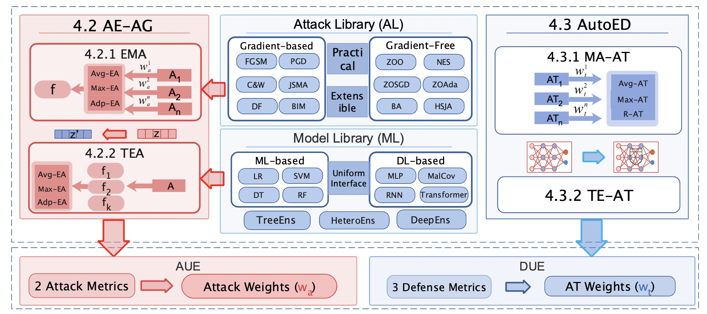

# CARE
Ensemble Adversarial Robustness Evaluation Against Adaptive Attackers for Security Applications
## what is CARE?


CARE is an ensemble adversarial robustness evaluation platform in the cybersecurity domain. The CARE framework consists of three basic components and two ensemble robustness evaluation components. The three basic components are: 1) Attack Library (AL) 2) Model Library (ML) 3) Attack and Defense Utility Evaluation (AUE \& DUE); the two ensemble robustness evaluation components are: 1) Adaptive Ensemble Attack Generation (AE-AG) 2) Automatic Ensemble Defense (AutoED)


## Background
The widespread adoption of ensemble techniques, including model ensembles and ensemble defenses raises many questions: Are general model ensembles and ensembles defenses guaranteed to be more robust than individuals? Will stronger adaptive attacks defeat existing ensemble defense strategies as the cybersecurity arms race progresses? Can ensemble defenses achieve adversarial robustness to different types of attacks simultaneously and resist the continually adjusted adaptive attacks? Unfortunately, these critical questions remain unresolved as there are no platforms for comprehensive evaluation of ensemble techniques in the cybersecurity domain.

## Introduction
In this paper, we propose a general Cybersecurity Adversarial Robustness Evaluation (CARE) platform aiming to bridge this gap. First of all, CARE comprehensively evaluates the defense effectiveness of model ensembles and ensemble defenses across the machine learning space for security applications. And then, we explore adaptive ensemble attacks in two cases, including an ensemble of multiple attack methods and a transfer ensemble attack to obtain an adversarial example that satisfies the problem-space constraints. Moreover, we propose an improved ensemble defense method: robust ensemble adversarial training, which enables the adversarial training to resist multiple attack methods simultaneously, ensuring resistance to adaptive ensemble attacks. Finally, we conduct experiments on five security application datasets against 12 security detectors using 15 attack and 8 defense strategies. Experimental results show that existing model ensembles and ensemble adversarial training methods fail to guarantee enhanced model robustness against adaptive attackers, whereas our robust ensemble adversarial training is capable of resisting multiple attack methods and adaptive attacks simultaneously. In summary, we hope our framework will provide benchmarking platforms for ensemble adversarial attacks and defenses of security detectors, similar to penetration testing platforms applied in the field of cybersecurity.

## Implementation Notes
* Special Python dependencies: numpy,pandas,lightgbm,xgboost,catboost,pytorch,sklearn,matplotlib
* The source code has been tested with Python 3.6 on a MacOS 64bit machine

## Usage

1. **Set the root path**:
   For example, See line 2 in `test/test_evasion_binary` :

   ``` python
    ROOT_PATH=''
    sys.path.append(ROOT_PATH)
    ```

2. **Set the datasets and models**:
   See line 59 in `csmt/get_model_data.py` :

   ``` python
    parser.add('--algorithms', required=False, default=['lstm_keras','ae','ft_transformer','lr', 'svm','dt','rf','xgboost','lightgbm','catboost','deepforest','knn','hmm','mlp_keras','mlp_torch','cnn_torch','kitnet','if','diff-rf','soft_ensemble','hard_ensmeble','stacking_ensemble','bayes_ensemble'])
    parser.add('--evasion_algorithms',default=['fgsm','pgd','cw','bound','jsma','bim','deepfool','zoo','hsj','zones','zosgd','zoscd','zoadamm','zo_shap_sgd','zo_shap_scd','tree','zosgd_sum'])
    parser.add('--datasets',required=False, default='cicids2017'])
    ```

 1. **Start adversarial attacks**:
    * Source code in `/care/attacks/evasion/evasion_attack.py`

    * Run
    ``` python
        python tests/test_evasion_binary.py
    ```

 2. **Start adversarial training**:
    * Source code in `care/defences/trainer/adversarial_trainer.py`
    ``` python
        def EnsembleAdversarialTrainer()
    ```
    * Run
    ``` python
        python tests/test_adv_train.py
    ```
