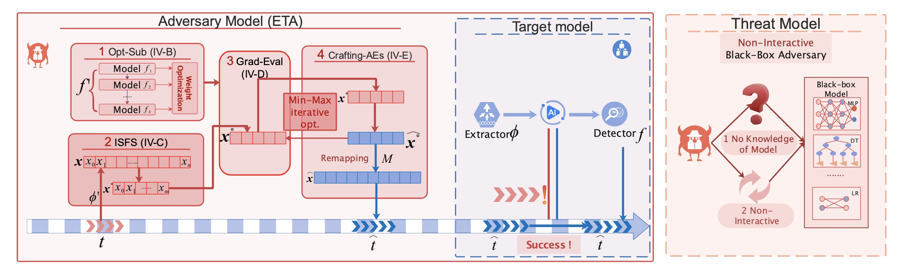

# ETA
Explainable and Transferable Adversarial Attack for ML-Based Network Intrusion Detectors
## what is ETA?
ETA is a general Explainable Transfer-based black-box adversarial Attack framework aiming to 1) craft transferable adversarial examples across various types of ML models and 2) explain why adversarial examples and adversarial transferability exist in NIDSs.


On the left of (a), An overview of our Explainable Transfer-based Attack (ETA) framework—Our framework consists of four core steps: (1) Optimizing the substitute model (Opt-Sub),(2) Important-Sensitive Feature Selection (ISFS), (3) Gradient
evaluation based on zeroth-order optimization (Grad-Eval), (4) Crafting AEs in domain constraints. (Crafting-AEs).
On the right of (a), the target model consists of a traffic capturer, feature extractor and ML-based classifier. In (b), the attacker does not know the target model’s architecture and cannot freely interact with the target models.

## Background
Machine learning (ML) has proven to be highly vulnerable to adversarial attacks despite being widely used in network intrusion detection systems (NIDSs). However, existing white-box attacks unrealistically assume that the attackers have full knowledge of the target NIDSs; existing blackbox attacks can not achieve a high attack success rate. Additionally, neither of them explains why adversarial examples (AEs) exist and why they can transfer across models.

## Introduction

To make adversarial attacks more practical and effective, we present general black-box adversarial attack framework that is both transferrable and explainable. Specifically, we present the first general transfer-based adversarial attack methods applicable across the entire ML space. And we exploit a unique insight based on cooperative game theory and perturbation interpretations to explain the existence of adversarial examples and adversarial transferability. Finally, we propose a novel method Important-Sensitive Feature Selection (ISFS) to guide the search for adversarial examples, achieving stronger transferability and ensuring traffic-space constraints.
We systematically evaluate the efficiency and effectiveness of adversarial attacks against several classical and state-of-the-art ML-based NIDSs on two public NIDSs datasets (flow-based and packet-based). Our experimental results show that our method achieves an average attack success rate of 70%, a 30% improvement over four latest baselines. Moreover, we conduct three interpretation experiments and two cases to explain the causes of AEs and adversarial transferability. Meanwhile, we reveal two major misconceptions with the current application of machine learning to NIDSs systems. The findings could provide security researchers with a better understanding of model decisions and an ideal direction for developing ML-based NIDSs.

## Implementation Notes
* Special Python dependencies: numpy,pandas,lightgbm,xgboost,catboost,pytorch,sklearn,matplotlib
* The source code has been tested with Python 3.6 on a MacOS 64bit machine

## Usage

1. **Set the root path**:
   For example, See line 2 in `tests/test_evasion_binary` :

   ``` python
    ROOT_PATH=''
    sys.path.append(ROOT_PATH)
    ```

2. **Set the datasets and models**:
   See line 59 in `csmt/get_model_data.py` :

   ``` python
    parser.add('--algorithms', required=False, default=['kitnet','diff-rf'])
    parser.add('--datasets',required=False, default='cicids2017'])
    ```

 1. **Start the interpretability**:
    * Source code in `csmt/interpretability/fai`

    * Run
    ``` python
        python test/test_fai.py
    ```

 2. **Start the adversarial attack**:
    * Source code in `csmt/attacks/evasion/zosgd_shap_sum.py`
    ``` python
        def ZOSGDShapSumMethod()
    ```
    * Run
    ``` python
        python test/test_evasion_binary_figure.py
    ```

